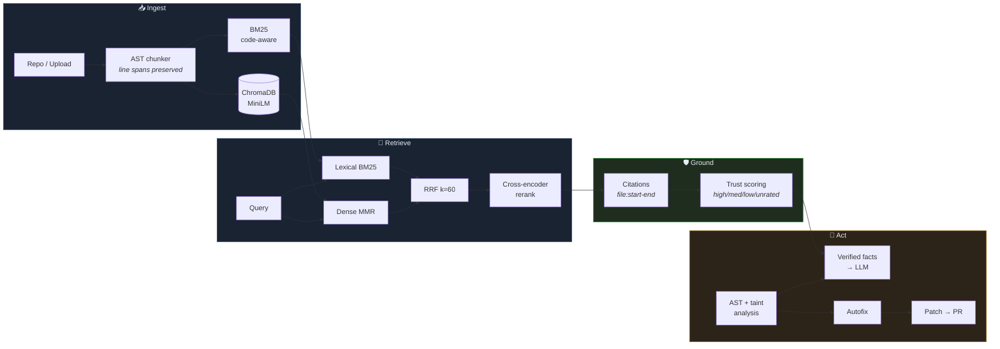

<div align="center">

# 🧙‍♂️ SavFlux

### Code review that shows its work.

**Most AI reviewers hand you a paragraph and ask you to trust it.**
SavFlux hands you a line number, the source that justifies it, a confidence
score, and — when the fix is unambiguous — a patch that applies cleanly.

[](#-testing)
[](#-the-0-guarantee)
[](https://python.org)
[](https://fastapi.tiangolo.com)
[](https://react.dev)

[Why it's different](#-why-another-code-review-tool) ·
[Quickstart](#-quickstart-5-minutes) ·
[How it works](#-how-it-works) ·
[Benchmarks](#-benchmarks) ·
[Roadmap](#-roadmap)

</div>

---

## 🎯 Why another code review tool?

Ask a typical LLM reviewer about a 700-line file and you get confident prose
with no way to check it. Three specific failure modes follow, and SavFlux is
built around fixing each one.

<table>
<tr><th width="33%">The problem</th><th width="33%">What SavFlux does</th><th width="33%">Why it works</th></tr>
<tr>
<td><b>🎭 Ungrounded claims.</b><br>"The auth logic looks risky" — in which of the 700 lines?</td>
<td><b>Line-precise citations.</b><br>Every claim carries <code>auth.py:42-58</code>. Click it and the file opens scrolled to those lines, highlighted.</td>
<td>Chunks carry absolute line spans through the whole pipeline. Only chunks that fit the context budget are cited, so sources match what the model actually read.</td>
</tr>
<tr>
<td><b>🔍 Pattern matching dressed as analysis.</b><br>Regex scanners flag safe code and miss real bugs.</td>
<td><b>AST + dataflow.</b><br>A taint tracker follows a string from the f-string that built it to the <code>execute()</code> that runs it.</td>
<td>F1 went <b>0.67 → 1.00</b> on a 17-case labelled corpus. Both the false positive and all four missed vulnerabilities are gone. <a href="#-benchmarks">Reproduce it →</a></td>
</tr>
<tr>
<td><b>🛑 Reviews that stop at "you should fix this."</b></td>
<td><b>Verified autofix + real patches.</b><br>Six rule classes repair themselves; the result is a diff that <code>git apply</code> accepts.</td>
<td>Every fix must parse, clear its finding, and introduce nothing worse — or it is discarded and reported as skipped.</td>
</tr>
</table>

---

## 🔬 The honesty machine

The design principle throughout: **never claim more certainty than you have.**

```
VERIFIED    parser proved it, including dataflow across lines
            → stated as fact, fed to the LLM as "do not re-derive"

LIKELY      heuristic matched
            → rendered with "(likely)", LLM told to confirm before repeating

UNRATED     the reranker never scored this chunk
            → shown as "not scored", never as "low"
```

That last one matters more than it looks. A chunk the reranker skipped is
**not** a chunk judged weak, and conflating them tells the user their evidence
was assessed and found wanting when it was never assessed at all. `unrated`
renders in its own colour everywhere in the UI.

The same rule governs autofix. Six rule classes have exactly one correct
repair, so they are fixed deterministically. SQL injection, shell injection,
hardcoded secrets and `eval()` are **reported but never rewritten** — which
column is a value versus an identifier, where a secret should live, what the
shell command should become all need context a parser does not have. Guessing
there is how autofix tools break production and lose trust permanently.

---

## ⚡ What it actually does

<details open>
<summary><b>Ask questions about a codebase, get answers with receipts</b></summary>

```
You:  where do we validate the JWT signature?

SavFlux:  Signature validation happens in `verify_token`, which calls
           `jwt.decode` with `algorithms=["RS256"]` — an explicit allow-list,
           so the "alg: none" downgrade is not reachable here.

           📎 auth/tokens.py:42-58   [high · 6.2]
           📎 auth/middleware.py:88  [medium · 1.4]
```

Click a citation → the file opens, scrolled to line 42, those lines
highlighted. The trust chip is the real cross-encoder score, not a guess.
</details>

<details>
<summary><b>Review a repo and get findings you can act on</b></summary>

```
🛑 SQL injection — L47 · CWE-89
   The query passed here is built by string interpolation on line 43, so any
   quote or semicolon in the interpolated value changes the statement.
   > cursor.execute(query)
   Fix: Pass values as parameters — execute("... WHERE id = ?", (value,))

🔵 Unnecessary shell invocation — L88 · CWE-78 (likely)
   The command is a fixed string, so there is no injection here, but running
   it through a shell costs a process and inherits shell quoting rules.
```

Note the second one is graded **LOW**, not CRITICAL. A static command with
`shell=True` is a style problem; grading it alongside a real RCE is how a
report becomes noise that gets ignored.
</details>

<details>
<summary><b>Fix what's mechanically fixable, then open the PR</b></summary>

```bash
POST /api/v1/review/autofix   { "path": "net.py" }
```
```json
{
  "fixed": true,
  "fixes": [
    { "rule_id": "PY-SEC-NOVERIFY", "line": 4, "description": "TLS verification disabled" },
    { "rule_id": "PY-SEC-WEAKHASH", "line": 6, "description": "Weak hash md5" }
  ],
  "skipped": [],
  "score_before": 3, "score_after": 10,
  "patch": { "diff": "diff --git a/net.py b/net.py\n...", "digest": "069313e55d0a1c27" }
}
```

That diff applies with `git apply`. Verified in CI against a real scratch repo,
not by string comparison.
</details>

---

## 🧠 How it works



### The trick that makes small models punch above their weight

Asking a 7B local model to find a cross-line SQL injection in 400 lines is
asking it to perform dataflow analysis in a single forward pass. It will miss
cases and invent others.

So SavFlux does the dataflow in a parser first and hands the model a brief:

```
VERIFIED ISSUES (found by parser — treat as fact, do not re-derive):
  L47 [critical] PY-SEC-SQLI: SQL injection
  L88 [low]      PY-SEC-SHELL-STATIC: Unnecessary shell invocation

POSSIBLE ISSUES (heuristic — confirm against the source before repeating):
  L12 [medium] Non-constant-time secret comparison
```

The model stops hunting for pattern-level defects and spends its budget on what
it is genuinely good at: what breaks in production, which caller is exposed,
what to fix first. Deterministic work goes to the parser (~8ms/file); judgement
goes to the model.

---

## 📊 Benchmarks

### Security detection — reproducible right now

17 labelled Python cases, 9 vulnerable and 8 safe, comparing the old regex
triage (commit `2b049e9`) against the current AST analyzer:

| | Precision | Recall | **F1** | False positives | Missed bugs |
|---|:---:|:---:|:---:|:---:|:---:|
| Regex triage | 0.83 | 0.56 | `0.67` | 1 | 4 |
| **AST + taint** | **1.00** | **1.00** | **`1.00`** | **0** | **0** |

The two cases that define the gap:

```python
# FALSE POSITIVE under regex — this is the correct, safe form
conn.execute("SELECT * FROM users WHERE id = ?", (user_id,))
#  → "Dynamic SQL: use parameterised queries"  (you already did)

# MISSED by regex — no single line matches
sql = "DELETE FROM t WHERE id = " + str(uid)
conn.execute(sql)
#  → caught by the taint tracker, which names both lines
```

```bash
# reproduce
python3 scripts/bench_security.py
```

### Speed

| Operation | Measured |
|---|---|
| AST analysis | **8.4 ms/file** (98-file repo in 853 ms) |
| Full backend test suite | **316 tests in ~4.5 s** |
| Patch generation | in-process `difflib`, no subprocess |

### Retrieval

`eval_rag.py` runs 45 queries against SavFlux's own source and reports Hit
Rate@K, MRR, symbol recall, Precision@K and latency. It runs on every CI push
and **fails the build below 40% hit rate**.

```bash
python eval_rag.py --top-k 5 --json-out reports/rag.json
```

> Numbers are machine- and corpus-dependent — the dataset targets this
> repository specifically, so treat it as a regression guard rather than a
> universal score. Run it yourself; results print with a dataset hash.

---

## 💸 The $0 guarantee

Every feature works with no paid API, no credit card, no trial.

| Component | Free default | Optional upgrade |
|---|---|---|
| Embeddings | `all-MiniLM-L6-v2`, local CPU | OpenAI `text-embedding-3-small` |
| Reranking | `ms-marco-MiniLM-L-6-v2`, local CPU | — |
| Chat / review | Ollama (`qwen2.5-coder`) | DeepSeek · GPT-4o |
| Static analysis | stdlib `ast` | — *(always free)* |
| Autofix | stdlib `ast` | — *(always free)* |
| CVE lookup | OSV.dev, no key | — |
| Vector store | ChromaDB, on disk | — |

The security analyzer, autofix, patch builder and citations involve **no model
call at all** — they are parser work. The LLM is used only where judgement is
required, which is also why the free local path stays genuinely usable rather
than being a degraded tier.

---

## 🚀 Quickstart (5 minutes)

**Prerequisites:** Python 3.11+, Node 18+, and [Ollama](https://ollama.com) for
the free path.

```bash
git clone https://github.com/garimauttam/SavFlux && cd SavFlux
```

<table>
<tr><td width="50%" valign="top">

**1 · Backend**
```bash
cd backend
python -m venv .venv
source .venv/bin/activate
pip install -r requirements.txt
```

**2 · Free local model**
```bash
ollama pull qwen2.5-coder:14b
```
```bash
cat > .env <<'EOF'
LLM_PROVIDER=ollama
OLLAMA_CHAT_MODEL=qwen2.5-coder:14b
OLLAMA_BASE_URL=http://localhost:11434
EOF
```

</td><td width="50%" valign="top">

**3 · Run it**
```bash
uvicorn main:app --reload --port 8000
```
```bash
cd ../frontend
npm install && npm run dev
```

**4 · Open** → http://localhost:5173

First run downloads the MiniLM models
(~120 MB) and caches them. Check
`GET /health` — it reports each
provider's real status.

</td></tr>
</table>

<details>
<summary><b>Prefer a hosted model?</b></summary>

```env
LLM_PROVIDER=deepseek
DEEPSEEK_API_KEY=your_key    # platform.deepseek.com
```
Embeddings stay local, so switching chat providers needs no re-index. Only
changing the *embedding* provider requires one.
</details>

<details>
<summary><b>Tuning review throughput</b></summary>

```env
REVIEW_MODE=fast          # fast | agentic
REVIEW_MAX_FULL_FILES=8   # files getting a full LLM pass
REVIEW_CONCURRENCY=2      # parallel LLM reviews
```
`fast` runs deterministic analysis plus one model call per prioritised file.
Files beyond the budget still get full AST analysis — static triage here is a
real review, not a placeholder. Use `agentic` for the deeper multi-turn tool
loop when you can accept the latency.
</details>

<details>
<summary><b>Docker</b></summary>

```bash
docker compose up --build
```
</details>

---

## 🧩 Under the hood

<details>
<summary><b>Retrieval pipeline</b></summary>

1. **Intent routing + `@file` scoping** — `@auth.py where is the token checked?`
   filters the candidate pool before any search runs.
2. **Query variants** generated locally (no model call).
3. **Dense** Chroma MMR search over `max(top_k × 3, 10)` candidates, **plus**
   BM25 with code-aware tokenisation (camelCase and snake_case split).
4. **Reciprocal Rank Fusion** (`k=60`, 50/50) merges the two rankings.
5. **Cross-encoder rerank** with `ms-marco-MiniLM-L-6-v2`; degrades gracefully
   to fused rank after repeated failures rather than erroring.
6. **Diversify** (max 2–3 chunks per source) and cap at the context budget.
7. **Cite** only the chunks that survived the cap.
</details>

<details>
<summary><b>Analyzer rules</b></summary>

**Python (AST + taint):** SQL injection · shell injection · `eval`/`exec` ·
unsafe deserialisation · hardcoded credentials · TLS verification disabled ·
weak hashes · `tempfile.mktemp` · non-constant-time secret comparison ·
silently swallowed exceptions · bare `except` · `assert` for validation ·
cyclomatic complexity · nesting depth · parameter count

**JS/TS/Go/Java/Rust (comment- and string-aware scanning):** `eval` ·
`new Function` · `innerHTML` · `dangerouslySetInnerHTML` · `child_process.exec`
(alias-aware) · TLS disabled · weak hashes · empty catch · ignored errors ·
AWS/GitHub/Slack/Google key shapes · complexity

Comments and string bodies are blanked **before** matching, which removes the
largest false-positive class in line scanners: `// TODO: move password to env`
is not a leaked credential.
</details>

<details>
<summary><b>Autofix: the three gates</b></summary>

A repair is kept only if **all three** hold:

1. the result parses
2. the targeted finding is gone
3. no new finding of equal or higher severity appeared

Gate 3 is the important one — a fix that trades a MEDIUM for a HIGH has made
the codebase worse while looking like an improvement. Both gates are
mutation-tested: disabling either fails a specific test.

Fixes are minimal by construction. On a file with comments and blank lines,
exactly one line changes and a trailing `# note` survives, so the reviewer
reads a one-line security diff instead of a reformatted function.
</details>

<details>
<summary><b>Streaming protocol</b></summary>

SSE with inline markers, so the UI can render structure while tokens arrive:

| Marker | Payload |
|---|---|
| `__STATUS__…__STATUS_END__` | progress step + JSON metadata |
| `__SOURCES__…__SOURCES_END__` | citation array with spans and trust |
| `__DIAGNOSTIC__…__DIAGNOSTIC_END__` | retrieval diagnostics |
| `__SECTION_START__…__SECTION_END__` | review section boundaries |
| `__ERROR__…__ERROR_END__` | recoverable error |
</details>

<details>
<summary><b>Project shape</b></summary>

```
backend/
  app/api/            23 routers · 72 endpoints
  app/services/       33 services
    code_analysis/    ← AST engine, autofix, models
    citation_service.py
    patch_service.py
    retrieval_service.py · hybrid_retriever.py · reranker.py
  tests/              32 files · 316 tests
frontend/src/
  components/         31 React components
  lib/openFile.ts     ← typed navigation contract
eval_rag.py           45-query retrieval benchmark (runs in CI)
scripts/              reproducible benchmarks
```
~13k lines of Python in `app/`.
</details>

---

## 🧪 Testing

```bash
cd backend && pytest -q                 # 316 tests, ~4.5s
cd frontend && npx tsc --noEmit         # type check
python3 scripts/bench_security.py       # reproduce the F1 table
```

Tests assert **behaviour, not wording** — `git apply --check` runs against a
real scratch repo rather than comparing diff strings, which is how the
malformed-patch bug below was caught.

Three bugs these tests found in code written for this project:

| Bug | How it surfaced |
|---|---|
| Malformed no-newline patches rejected by `git apply` | real `git apply --check`, not string assertions |
| O(n²) diff annotation — **96.7s → 0.59s** | `pytest --durations` on a size-limit test |
| `summarise_fixes` swallowed the rejection list | a test asserting failures are reported honestly |

Plus two false positives found by running the analyzer over this repo's own
98 files: `/regex/.exec(str)` reported as shell injection, and an optional-file
read with a `pass` fallback reported as a swallowed error. Both have regression
tests. Total findings on this repo dropped 198 → 157 with no loss of true
positives.

---

## 🗺 Roadmap

**Shipped**

- [x] Line-precise citations with click-to-open and trust scoring
- [x] AST + dataflow security analysis (F1 0.67 → 1.00)
- [x] Verified deterministic autofix
- [x] Git-applicable patch generation + PR creation
- [x] Hybrid retrieval: BM25 + dense + RRF + cross-encoder
- [x] OSV CVE scanning (no API key)
- [x] RAG benchmark gating CI
- [x] GitHub Action PR review

**Next**

- [ ] **Apply-patch button** in the review panel (backend is done)
- [ ] **VS Code extension** — thin client over `POST /chat/stream`
- [ ] **Incremental indexing** — `watcher_service.poll_once()` exists; needs delta ingest
- [ ] **Symbol graph** for jump-to-definition
- [ ] **Autofix for JS/TS** — currently Python only
- [ ] **Policy gates** — block writes above a risk threshold without a second approval
- [ ] **Cross-session memory** — history compacts to 6 turns today
- [ ] **Eval dashboard** charting `GET /metrics`
- [ ] **GitHub OAuth** onboarding instead of a manual PAT

---

## 🤝 Contributing

Three conventions, all enforced by tests:

1. **Every rule needs a negative case.** A detector without a test proving it
   stays quiet on the safe form of the same construct will eventually be turned
   off by users.
2. **Verify the fix, don't trust it.** New autofix rules must satisfy all three
   gates.
3. **Mutation-check new tests.** Re-introduce the bug and confirm the test
   fails. A test that passes both ways is decoration.

---

## 📄 License

MIT — see [LICENSE](LICENSE).

<div align="center">
<br>
<i>Built for engineers who want to verify, not just believe.</i>
</div>
