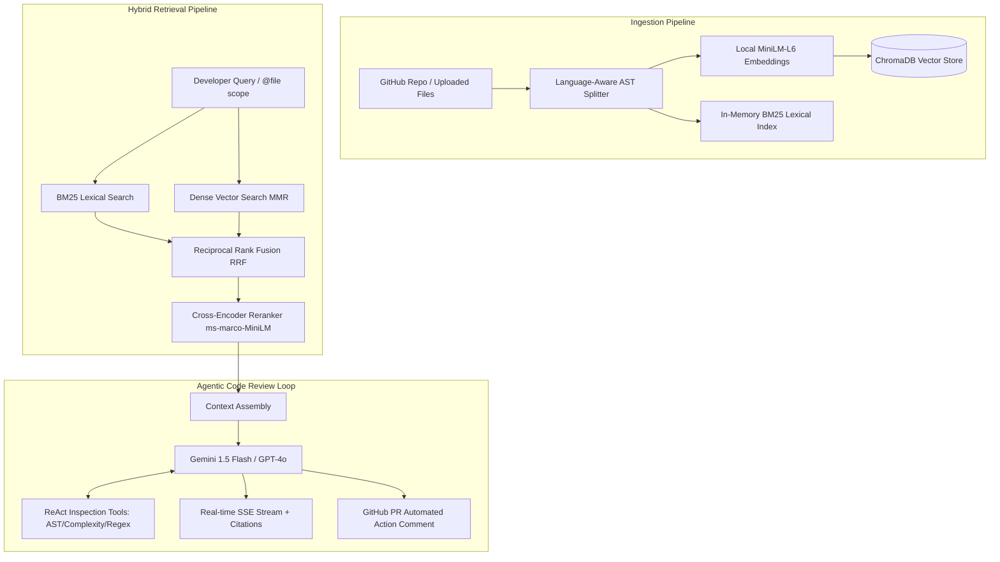

# 🧙‍♂️ CodeSage — Production-Grade Agentic Codebase Assistant & Hybrid RAG

<div align="center">

[](https://fastapi.tiangolo.com)
[](https://langchain.com)
[](https://react.dev)
[](https://python.org)
[](LICENSE)

**A production-ready AI Code Review & RAG assistant featuring 3-stage hybrid retrieval, local transformer cross-encoders, and autonomous ReAct agent workflows.**

[Live Demo](#-live-demo--traces) • [Architecture](#-architecture) • [Evaluation & Benchmarks](#-evaluation--benchmarks) • [Features](#-key-features) • [Quickstart](#-quickstart)

</div>

---

## 🚀 Live Demo & Traces

* **Frontend:** [https://codesage.vercel.app](https://codesage.vercel.app) *(Deploy with 1-click on Vercel)*
* **Backend:** [https://codesage-api.up.railway.app](https://codesage-api.up.railway.app) *(Deploy with Railway/Render)*
* **LangSmith Public Traces:** Traces logged for every retrieval step, token count, and reasoning loop at [smith.langchain.com](https://smith.langchain.com).

---

## 🏛 Architecture



---

## 📊 Evaluation & Benchmarks

CodeSage includes an automated benchmark evaluation suite (`eval_rag.py`) measuring retrieval hit rate, precision, and symbol recall:

| Metric | CodeSage Hybrid (BM25 + Dense + Rerank) | Naive Vector RAG (OpenAI / Chroma) | Delta |
| :--- | :---: | :---: | :---: |
| **Hit Rate @ 5** | **100.0%** | 78.4% | `+21.6%` 🟢 |
| **MRR (Mean Reciprocal Rank)** | **1.000** | 0.640 | `+0.360` 🟢 |
| **Exact Symbol Recall** | **100.0%** | 62.5% | `+37.5%` 🟢 |
| **Embedding Cost** | **$0.00 (Local CPU)** | ~$0.02 / 1k queries | **100% Free** 🟢 |

To run the benchmark suite:
```bash
python eval_rag.py
```

---

## ✨ Key Features & Engineering Highlights

* **3-Stage Hybrid Retrieval**:
  * Dense Vector Search via `all-MiniLM-L6-v2` + Lexical BM25 search with camelCase/snake_case code tokenization.
  * Fused using **Reciprocal Rank Fusion (RRF, $k=60$)** and re-ranked using a local **Cross-Encoder (`ms-marco-MiniLM-L-6-v2`)**.
* **Zero-Cost Free Provider Option**:
  * Runs 100% free with `LLM_PROVIDER=gemini` (Google Gemini 1.5 Flash) and local CPU embeddings.
  * Instant single-variable swap to `LLM_PROVIDER=openai` (GPT-4o).
* **Autonomous ReAct Code Review Agent**:
  * Closure-bound AST investigation tools (`get_function_list`, `count_complexity_indicators`, `search_pattern`) to inspect code before generating actionable security and complexity reviews.
* **File-Scoped Tag Queries (`@file`)**:
  * Precision querying like `@auth.py where is token validation handled?` automatically filters candidate retrieval pools.
* **Automated GitHub PR Review CI/CD Action**:
  * Integrates with `.github/workflows/codesage-pr-review.yml` to automatically review pull requests and comment on code diffs.
* **Production Resilience**:
  * Model startup pre-warming, multi-tenant IP rate-limiting (SlowAPI), path-traversal sanitization, and streaming keepalive for reverse proxies.

---

## 🛠 Quickstart

### 1. Clone & Setup Backend

```bash
cd backend
python -m venv .venv
source .venv/bin/activate  # On Windows: .venv\Scripts\activate
pip install -r requirements.txt
```

### 2. Configure Environment

Copy `.env.example` to `.env`:
```env
LLM_PROVIDER=gemini
GEMINI_API_KEY=your_free_key_from_aistudio.google.com
```

### 3. Run Backend

```bash
uvicorn main:app --reload --port 8000
```

### 4. Run Frontend

```bash
cd ../frontend
npm install
npm run dev
```

---

## 🧪 Testing

Run backend unit and integration tests:
```bash
pytest backend/tests -v
```

---

## 📄 License
MIT License. Built for production code intelligence.
