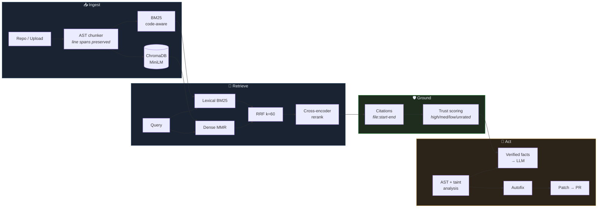

<div align="center">

# SavFlux

### Code review that shows its work.

**Most AI reviewers hand you a paragraph and ask you to trust it.** SavFlux hands
you a line number, the source that justifies it, a confidence score, and — when the
fix is unambiguous — a patch that `git apply` accepts.

Model inference can run on free local models by default; no paid model API key is
required. SavFlux does require a Supabase project for account sign-in. No credit
card or trial that expires into a bill is needed for the local-model path.

[](#-testing)
[](#-the-0-guarantee)
[](#what-the-browser-downloads)
[](https://python.org)
[](https://fastapi.tiangolo.com)
[](https://react.dev)

[Start here](#-quickstart) ·
[What you can do](#-the-workspace) ·
[GitHub + branches](#-github-end-to-end) ·
[How it works](#-how-it-works) ·
[Benchmarks](#-benchmarks) ·
[Security & limits](#-what-it-does-not-do) ·
[Troubleshooting](#-troubleshooting)

</div>

---

## 🧭 A useful first run

SavFlux is built around one short loop: **bring code in → ask or review → inspect evidence → decide what ships.**

| Step | In SavFlux | What to expect |
|---|---|---|
| **1. Choose code** | Connect GitHub, select a repository, or upload files | Public repositories can be indexed without a GitHub token; private repositories need a connected account. |
| **2. Choose a branch and index** | Use the branch picker beside the repository name, then index it | The selected branch is now the branch SavFlux indexes for that repository. Ingestion reports progress and errors instead of leaving a blank state. |
| **3. Ask or review** | Ask a code question in Agent, or run Review | Answers show the source lines used. Reviews combine static analysis with bounded model review. |
| **4. Inspect changes** | Open **Changes** | **Branches** compares remote GitHub refs; **Agent workspace** shows persistent local Agent edits; **Indexed files** compares file contents already stored in SavFlux’s index. These are distinct views, not aliases for one another. |
| **5. Ship only what you approve** | Review the patch and explicitly confirm the exact diff before opening a PR | Agent-generated patches are proposals until you confirm them. SavFlux does not silently push. |

The default model path is local Ollama and costs **$0** in provider fees. If the local runtime or model is unavailable, SavFlux reports that; it does not pretend a hosted fallback or a generated answer happened.

---

## 🎯 Why another code review tool?

Ask a typical LLM reviewer about a 700-line file and you get confident prose with
no way to check it. Three specific failure modes follow from that, and SavFlux is
built around fixing each one.

<table>
<tr><th width="33%">The problem</th><th width="33%">What SavFlux does</th><th width="33%">Why it works</th></tr>
<tr>
<td><b>🎭 Ungrounded claims.</b><br>"The auth logic looks risky" — in which of the 700 lines?</td>
<td><b>Line-precise citations.</b><br>Every claim carries <code>auth.py:42-58</code>. Click it and the file opens scrolled to those lines, highlighted.</td>
<td>Chunks carry absolute line spans through the whole pipeline. Only chunks that fit the context budget are cited, so sources match what the model actually read.</td>
</tr>
<tr>
<td><b>🔍 Pattern matching dressed as analysis.</b><br>Regex scanners flag safe code and miss real bugs.</td>
<td><b>AST + dataflow.</b><br>A taint tracker follows a string from the f-string that built it to the <code>execute()</code> that runs it.</td>
<td>F1 went <b>0.67 → 1.00</b> on a 17-case labelled corpus. Both the false positive and all four missed vulnerabilities are gone. <a href="#-benchmarks">Reproduce it →</a></td>
</tr>
<tr>
<td><b>🛑 Reviews that stop at "you should fix this."</b></td>
<td><b>Verified autofix + real patches.</b><br>Six rule classes repair themselves; the result is a diff that <code>git apply</code> accepts.</td>
<td>Every fix must parse, clear its finding, and introduce nothing worse — or it is discarded and reported as skipped.</td>
</tr>
</table>

---

## 🔬 The honesty machine

The design principle throughout: **never claim more certainty than you have.**

```
VERIFIED    parser proved it, including dataflow across lines
            → stated as fact, fed to the LLM as "do not re-derive"

LIKELY      heuristic matched
            → rendered with "(likely)", LLM told to confirm before repeating

UNRATED     the reranker never scored this chunk
            → shown as "not scored", never as "low"
```

That last one matters more than it looks. A chunk the reranker skipped is **not** a
chunk judged weak, and conflating them tells the user their evidence was assessed and
found wanting when it was never assessed at all. `unrated` renders in its own colour
everywhere in the UI.

The same rule governs everything the product measures about itself, which is why this
README has numbers instead of adjectives:

* A measurement that could not be taken reports `—`/absent, never `0.0%`. A
  disabled reranker, a cached review with no model call, a metric whose dataset
  does not name symbols — all three would print a zero that reads like a bad score.
* An unmeasured cost is not folded into a measured one. The retrieval benchmark
  times its own scoring separately (`harness_ms`) and excludes it from product
  latency, rather than inflating the number a reader compares.
* "We could not check" is a third answer, not a pass. The patch verifier returns
  `verified: null` when there is no git or no current content to patch against.

The same rule governs autofix. Six rule classes have exactly one correct repair, so
they are fixed deterministically. SQL injection, shell injection, hardcoded secrets
and `eval()` are **reported but never rewritten** — which column is a value versus an
identifier, where a secret should live, what the shell command should become all need
context a parser does not have. Guessing there is how autofix tools break production
and lose trust permanently.

---

## ⚡ What it actually does

<details open>
<summary><b>Ask questions about a codebase, get answers with receipts</b></summary>

```
You:  where do we validate the JWT signature?

SavFlux:  Signature validation happens in `verify_token`, which calls
           `jwt.decode` with `algorithms=["RS256"]` — an explicit allow-list,
           so the "alg: none" downgrade is not reachable here.

           📎 auth/tokens.py:42-58   [high · 6.2]
           📎 auth/middleware.py:88  [medium · 1.4]
```

Click a citation → the file opens, scrolled to line 42, those lines highlighted. The
trust chip is the real cross-encoder score, not a guess.
</details>

<details>
<summary><b>Review a repo and get findings you can act on</b></summary>

```
🛑 SQL injection — L47 · CWE-89
   The query passed here is built by string interpolation on line 43, so any
   quote or semicolon in the interpolated value changes the statement.
   > cursor.execute(query)
   Fix: Pass values as parameters — execute("... WHERE id = ?", (value,))

🔵 Unnecessary shell invocation — L88 · CWE-78 (likely)
   The command is a fixed string, so there is no injection here, but running
   it through a shell costs a process and inherits shell quoting rules.
```

Note the second one is graded **LOW**, not CRITICAL. A static command with
`shell=True` is a style problem; grading it alongside a real RCE is how a report
becomes noise that gets ignored.
</details>

<details>
<summary><b>See where the time went, not just that it was slow</b></summary>

Both review surfaces break the wait down: queue, analysis, model, per-file. The
distinction is the point — 40 s of parsing 98 files and 40 s of one model call want
different fixes, and a single elapsed number cannot tell them apart.

A result served from the review cache reports **"no model call"** rather than
`0 ms`, which would read as an impressively fast model.
</details>

<details>
<summary><b>Stop actually stops the run</b></summary>

Pressing Stop used to abort the browser's fetch while the model kept generating. Now:

* the multi-file reviewer checks for a stop **between files** and reports
  `Stopped — 12 of 30 file(s) were not reviewed`, naming what was skipped;
* a stop that arrives while every in-flight review is mid-model-call is noticed and
  reported, instead of the panel waiting for results nobody asked for;
* a run stopped before the model was called says `stopped_before_model: true`, and
  the writer distinguishes partial output from nothing written;
* an abandoned run emits **no** `coverage`, `timing` or `complete` event, so no
  downstream surface can mistake it for a finished one.

Cancellation is its own vocabulary (`step="cancelled"`), never an error: you stopped
it, nothing went wrong.
</details>

<details>
<summary><b>Fix what's mechanically fixable, then open the PR</b></summary>

```bash
POST /api/v1/review/autofix   { "path": "net.py" }
```
```json
{
  "fixed": true,
  "fixes": [
    { "rule_id": "PY-SEC-NOVERIFY", "line": 4, "description": "TLS verification disabled" },
    { "rule_id": "PY-SEC-WEAKHASH", "line": 6, "description": "Weak hash md5" }
  ],
  "skipped": [],
  "score_before": 3, "score_after": 10,
  "patch": { "diff": "diff --git a/net.py b/net.py\n...", "digest": "069313e55d0a1c27" }
}
```

That diff applies with `git apply`. Verified in CI against a real scratch repo, not
by string comparison.

The review cache is inspectable state, so it has endpoints rather than being a
directory you have to find:

```bash
GET    /api/v1/review/cache   # { "entries": 7, "hit_rate": 0.67, ... }
DELETE /api/v1/review/cache   # { "removed": 7 } — force the next review to be cold
```

A review usually covers a dozen files, so the same gates run over a set in one
request — one patch, one digest, one thing to confirm:

```bash
POST /api/v1/review/autofix-set   { "files": [{ "path": "net.py", "source": "…::net.py" }] }
```

The gate is inspectable too, and it answers questions without attempting anything:

```bash
GET  /api/v1/policy              # thresholds, signal weights, ledger size
POST /api/v1/policy/assess       # score a diff or a set of files, get the token
POST /api/v1/policy/verify       # did this patch apply? (three states, not two)
GET  /api/v1/policy/ledger       # every decision: score, signals, reason, actor
```

**Nothing reaches GitHub without a confirmation.** `POST /review/create-pr` refuses
to push when the caller does not echo back the digest of the exact diff it displayed —
a stale preview or a swapped diff fails the check instead of being pushed. Without a
`GITHUB_TOKEN` the same endpoint answers with the `gh pr create` command and the
patch, so the whole path works at $0.

The review panel and the agent both use it: review → *Find safe fixes* → read the diff
→ *Create PR…*. The agent's `create_pr` tool is a plan by default and only acts on a
confirmed digest, so a model decision alone can never open a pull request.
</details>

---

## 🪟 The workspace

The previous interface was **seventeen tabs in one flat row**. On a laptop the strip
scrolled and clipped its own tail behind prev/next arrows, so the sections people used
least were the ones hidden — which made the list look arbitrary. Seven of those
"tabs" were small local collections (`Prompts`, `Snippets`, `Activity`, `History`,
`Inbox`, `Slash`, `Bulk`), which is a filing system rather than a product, and `Chat`
and `Agent` split one job in two: you had to decide *which product* you were in before
you had said anything.

So the app is now **nine destinations in four groups**, and the agent conversation is
one surface with a mode switch:

| group | destinations |
|---|---|
| **Work** | Agent · Review · Write |
| **Understand** | Files · Graph · Health |
| **Ship** | Repositories · Changes |
| **Keep** | Library *(prompts, snippets, history, activity, inbox, commands, bulk, metrics)* |

`frontend/src/navigation.ts` is the only place that list exists. The rail, the command
palette, the `g`+key shortcuts and the reachability test all read from it, so a new
destination is one entry and none of those four can drift apart again.

**The rail does not collapse while you type.** The old rail expanded on hover, which
meant it shifted under the pointer every time you reached for the composer. It is now
*pinned* — the state is persisted in `localStorage`, defaults to expanded on a screen
wider than 1024px, and a chevron beside the logo toggles it deliberately.

| key | does |
|---|---|
| `⌘K` / `Ctrl+K` | command palette, including the GitHub actions |
| `g` then `a` `r` `w` `e` `g` `h` `o` `d` `l` | jump to a destination |
| `/` | focus search |
| `?` | keyboard shortcuts |
| `Esc` | close the palette, a dialog, or the context drawer |

`?` is suppressed while you are typing. The guard checks **both** `event.target` and
`document.activeElement` for an input, textarea or contenteditable, because the two
diverge for synthesized events, IME compositions and assistive technology — and
checking only the first meant that typing `where is the JWT signature?` into the
composer opened the shortcuts dialog and stole the question mark.

**Click a citation and the evidence opens beside the answer**, scrolled to the cited
line with that span marked, in a drawer rather than a permanent column, because on a
laptop the conversation needs the width. A citation that said "auth/tokens.py:42-58"
used to cost five steps and a tab switch; now the claim and its evidence are one click
apart, which is the only reason the rest of the product's honesty rules are worth
anything.

**Light and dark, both real.** `hooks/useTheme.ts` owns the preference, follows the OS
while set to *system*, and `index.html` applies the stored value in an inline script
before first paint — so the first frame is already the right theme instead of flashing
white at a dark-mode reader.

---

## 🔗 GitHub, end to end

GitHub is not a `GITHUB_TOKEN` read at push time. It is a connected account, a
browsable repository list, a branch list, an index you can build from what is there,
and one gated path that writes.

**Connect.** *Repositories → Connect GitHub*, or a PAT in settings. A token connected
**in the app** wins over `GITHUB_TOKEN` from the environment, because a machine that
already exports a `GITHUB_TOKEN` for CI, a deploy or a shell script should not have
those credentials silently drive a code review; disconnecting reports the environment
fallback rather than pretending the account is gone. Private clones pass the token as
`git -c http.https://github.com/.extraheader=…`, so it never lands in `.git/config`,
in a remote URL, or in a crash report.

```bash
GET    /api/v1/github/status                 # connected? valid? which source?
POST   /api/v1/github/connect               # store a PAT
DELETE /api/v1/github/connect               # remove it
GET    /api/v1/github/repos?q=&page=        # browse
GET    /api/v1/github/repos/{owner}/{name}  # one repository
GET    /api/v1/github/repos/{owner}/{name}/branches
POST   /api/v1/github/compare             # read-only base...head comparison
GET    /api/v1/github/repos/{owner}/{name}/pulls
GET    /api/v1/github/pulls/{owner}/{name}/{number}
GET    /api/v1/workspace/status?repo=owner/name # local Agent worktree diff
POST   /api/v1/workspace/reset?repo=owner/name  # discard local Agent edits
```

For example, after connecting GitHub, compare a feature branch with `main`:

```bash
curl -sS "$SAVFLUX_URL/api/v1/github/compare" \
  -H "Authorization: Bearer $SUPABASE_ACCESS_TOKEN" \
  -H "Content-Type: application/json" \
  -d '{"repo":"owner/repository","base":"main","head":"feature/my-change"}'
```

The response contains the remote refs, ahead/behind counts, bounded changed-file
patches, commit summaries, and the GitHub comparison URL. It does not mutate GitHub.

**Index.** Indexing a repository streams progress over SSE and also returns a `job_id`,
so a browser refresh or a dropped connection cannot silently lose an ingest — the
client polls `GET /api/v1/ingest/status/{job_id}` and finds out what happened. A public
repository can be ingested by URL with no token at all, and files can be uploaded
directly. Ingestion failures are translated by `friendly_ingest_error` before they reach
the UI: when the embedding step cannot reach `huggingface.co`, the reader is told that
the model could not be downloaded, not shown a raw `MaxRetryError` for a host name they
never typed. There is deliberately no silent hashing fallback — a hashed "embedding"
produces confident nonsense and is worse than an error.

**Compare branches.** Open **Changes → Branches**, choose a base and compare ref, and
SavFlux asks GitHub for a read-only `base...head` comparison. The page shows ahead /
behind counts, commit summaries, changed-file totals, and per-file patches. The repo’s
default branch is the initial base; the branch selected in the top bar is used as the
initial compare ref when it differs. You can change either selector before comparing.

The other Changes view, **Indexed files**, is intentionally different: it compares two
file contents already stored in SavFlux’s index. It can be useful for two snapshots,
but it is not a branch diff. The tab now names that distinction rather than making you
guess from two file pickers with the same basename.

**Agent workspace.** Each GitHub repository gets a dedicated SavFlux-managed local
branch when Agent successfully builds its first patch. The worktree starts at the exact
commit recorded by indexing, keeps uncommitted changes between visits, and refuses to
apply a later proposal if the index has moved or the local file no longer matches its
base. **Reset edits** is explicit and discards only that isolated workspace; it never
changes the remote branch.

**What “local” means here.** GitHub branch comparison is between remote GitHub refs.
Ingestion still deletes its temporary clone after indexing. When Agent builds a patch
for an indexed GitHub repository, SavFlux creates or reuses an isolated server-side Git
worktree on a local `savflux/agent-*` branch based on the exact indexed commit, applies
the verified proposal, and retains it across page loads. **Changes → Agent workspace**
shows that local diff and can reset it. It is not the developer’s laptop checkout, and
nothing is committed or pushed by that action. The existing digest-bound confirmation
is still required before a PR can write to GitHub.

**Ship.** Creating a pull request goes through the same digest-bound gate as the
autofix path: `POST /review/create-pr` refuses to push unless the caller echoes back
the digest of the exact diff it displayed, so a stale preview or a swapped diff fails
the check instead of being pushed. Without a token the same endpoint returns the
`gh pr create` command and the patch, so the path still works at $0.

---

## 🧠 How it works


```mermaid
flowchart LR
    subgraph INGEST["📥 Ingest"]
        A[Repo / Upload] --> B[AST chunker<br/><i>line spans preserved</i>]
        B --> C[(ChromaDB<br/>MiniLM)]
        B --> D[BM25<br/>code-aware]
    end

    subgraph RETRIEVE["🔎 Retrieve"]
        Q[Query] --> E[Dense MMR]
        Q --> F[Lexical BM25]
        E --> G[RRF k=60]
        F --> G
        G --> H[Cross-encoder<br/>rerank]
    end

    subgraph GROUND["🛡️ Ground"]
        H --> I[Citations<br/><i>file:start-end</i>]
        I --> J[Trust scoring<br/><i>high/med/low/unrated</i>]
    end

    subgraph ACT["🔧 Act"]
        K[AST + taint<br/>analysis] --> L[Verified facts<br/>→ LLM]
        K --> M[Autofix]
        M --> N[Patch → PR]
    end

    C --> E
    D --> F
    J --> L

    style INGEST fill:#1a2332,stroke:#2d4a6b,color:#e6edf3
    style RETRIEVE fill:#1a2332,stroke:#2d4a6b,color:#e6edf3
    style GROUND fill:#1f2d1f,stroke:#2ea043,color:#e6edf3
    style ACT fill:#2d2419,stroke:#9e6a03,color:#e6edf3
```

### The trick that makes small models punch above their weight

Asking a 7B local model to find a cross-line SQL injection in 400 lines is asking it
to perform dataflow analysis in a single forward pass. It will miss cases and invent
others.

So SavFlux does the dataflow in a parser first and hands the model a brief:

```
VERIFIED ISSUES (found by parser — treat as fact, do not re-derive):
  L47 [critical] PY-SEC-SQLI: SQL injection
  L88 [low]      PY-SEC-SHELL-STATIC: Unnecessary shell invocation

POSSIBLE ISSUES (heuristic — confirm against the source before repeating):
  L12 [medium] Non-constant-time secret comparison
```

The model stops hunting for pattern-level defects and spends its budget on what it is
genuinely good at: what breaks in production, which caller is exposed, what to fix
first. Deterministic work goes to the parser (~8 ms/file); judgement goes to the model.

---

## 📊 Benchmarks

Every number below is reproducible on a laptop with no network and no key. Where a
number could not be measured here, the section says so instead of quoting someone
else's.

### Security detection

17 labelled Python cases, 9 vulnerable and 8 safe. The **current** row is reproducible
by anyone with a clone; the regex row is what the same corpus measured against the
triage at `2b049e9`, read out of git history so the comparison cannot drift from what
actually shipped — that ref has to be in your clone for `--compare` to work:

| | Precision | Recall | **F1** | False positives | Missed bugs |
|---|:---:|:---:|:---:|:---:|:---:|
| Regex triage | 0.83 | 0.56 | `0.67` | 1 | 4 |
| **AST + taint** | **1.00** | **1.00** | **`1.00`** | **0** | **0** |

The two cases that define the gap:

```python
# FALSE POSITIVE under regex — this is the correct, safe form
conn.execute("SELECT * FROM users WHERE id = ?", (user_id,))
#  → "Dynamic SQL: use parameterised queries"  (you already did)

# MISSED by regex — no single line matches
sql = "DELETE FROM t WHERE id = " + str(uid)
conn.execute(sql)
#  → caught by the taint tracker, which names both lines
```

```bash
python3 scripts/bench_security.py                    # current analyzer (CI gate: F1 >= 0.95)
python3 scripts/bench_security.py --compare 2b049e9  # and the regex baseline it replaced
```

17 cases in **under 35 ms**, no model call.

### Retrieval

`eval_rag.py` runs 44 queries against SavFlux's own source. It reports per stage and
per retrieval leg (`bm25_only`, `dense_only`, `fused`, `fused_reranked`), at two
granularities, and records dataset and corpus hashes so runs over different inputs
cannot be silently blended.

**The regression gate.** CI holds every quality metric to a floor against a committed
baseline, and fails the build when one drops further than that floor:

```bash
python eval_rag.py --embedder offline --no-rerank \
  --gate benchmarks/rag_offline_baseline.json
```

This replaced `if hit_rate < 40: fail`. The score is **63.64**, so that floor could not
fail for any regression worth noticing — retrieval could have collapsed a third and CI
would have called it a pass. The gate catches a 16-point drop and names the six metrics
that moved. Floors are absolute and sized in queries: over 44 queries one query is 2.27
points of a rate, so 5 points is about two.

Two things the gate deliberately does **not** do:

- **Grade runs scored by different definitions.** A stricter answer key or a different
  corpus shape makes two runs incomparable; those rows are skipped with the reason
  printed, not failed.
- **Fail on a corpus change.** The corpus is this repository, so it moves on almost
  every commit and a fingerprint-keyed gate would either fail every PR or never fire. A
  changed corpus is reported as a `NOTE` instead — loud enough that a reader knows part
  of the movement is content, quiet enough to stay useful.

Latency is not gated. Those numbers come from one machine, and `--fail-on-regression`
already exists for them, labelled a smoke gate. To record a new baseline after an
intended improvement, let the diff be the record:

```bash
python eval_rag.py --embedder offline --no-rerank \
  --save-baseline benchmarks/rag_offline_baseline.json
```

The gate runs on pull requests, not only after merge. 20 tests in
`backend/tests/test_eval_gate.py` pin its behaviour, including that the old 40% rule
would *not* have caught a 21-point collapse.

**Record the baseline last.** The corpus is this repository's `backend/**/*.py`, so
*any* change under `backend/` — including adding a test file — moves the corpus hash.
A baseline recorded before such a change reports a `NOTE` on every run forever, which
is the noise this design is supposed to avoid. Three tests enforce the order: the
committed `corpus_sha256` must match the tree, the recorded unit/file counts must
match what ingestion actually produces, and the hash must be unchanged when the same
files are re-ingested from a different absolute path (which is what makes a laptop run
and a CI run comparable). If any of them fails, the fix is to re-run
`--save-baseline` above and commit that too.

`--embedder offline` is the deterministic hashing embedder: no download, no network.
It proves the dense branch's plumbing works and **its numbers are not a measure of
retrieval quality** — the report prints that itself, in the metric label, because a
lexical stand-in that quietly impersonates a model is worse than a failure.

| metric (offline embedder, top-k 5, measured on this tree) | value |
|---|:---:|
| Hit Rate@5, file level | 63.64% |
| Span Hit Rate@5, unit level | 50.00% |
| MRR | 0.456 |
| Symbol recall | 69.11% |
| Precision@5 | 17.27% |
| `bm25_only` → `dense_only` → `fused` hit@5 | 68.18% → 38.64% → 63.64% |
| retrieval latency | 136 ms/query avg, 125 ms p50 |
| dense stage's share of that | ~90% |

The last two rows are the same fact: the dense leg is a linear cosine scan over every
window, so retrieval latency tracks corpus size, and adding files moves every number.
Corpus here: 168 source files → 2,141 chunks → 3,185 embed windows (this tree; re-recorded with the baseline).

**The instrument needed fixing before it could be trusted**, and the story is worth
telling because both defects inflated the score:

1. The answer key matched by *substring* over a corpus that includes
   `backend/tests/` — so 4 of 17 ground truths matched several files and 11 of 44
   queries were scored against a test file that merely mentioned the module.
2. `hit_rate_at_k` was scored over the whole `top_k*3` fused list, which is the
   reranker's candidate depth, not K.

Correcting both moved Hit Rate@5 from **79.55% to 59.09%** on one tree, retrieval code
byte-identical — substring→exact alone took 79.55 to 77.27, and slicing to true `@K`
removed eight more hits that had been scored at ranks 6 through 13. The CI threshold is
40, so the gate passed before and passes now (63.64% on today's tree, 23.64 points of
headroom); what changed is that the margin is real. A benchmark that flatters you is
not a guard.

Also enforced now: `--embedder model` **refuses to embed a corpus through a paid API**.
It was the CLI default, and with `LLM_PROVIDER=openai` the product's embedder *is* a
metered endpoint, so the documented `python eval_rag.py` would have spent money
embedding ~1,900 units on any laptop that had a key set for the review model. It
raises instead, and a test fails if the paid client is constructed at all. Pass
`--embedding-model <name>` for a local model, cached weights only.

### Indexing: what a re-index costs, and what it may not skip

Ingestion embeds a file only when its bytes **and** the pipeline that produced its
vectors both match what is already stored. The identity covers the embedder, chunk
size and overlap, and the window constants, hashed to a 16-char stamp beside the
content hash on every chunk — because a vector is a function of both, and skipping on
content alone means a model swap leaves the index permanently incoherent: queries
embedded by the new model, scored against vectors from the old one.

Measured on this repo (2 CPU threads), reported by the harness as `embed_index_ms` and
`embed_units_per_second`:

| | deterministic offline-hashing leg | local MiniLM model |
|---|:---:|:---:|
| index 3,185 windows once (recorded baseline) | **391 ms** (8,139 windows/s) | Hardware-dependent; not measured in this CI environment |
| encode one query | a hash lookup (not a quality model) | Local model; no latency figure claimed here |
| re-ingest an unchanged repo | **nothing embedded** | **nothing embedded** |

The second row is the reason the identity exists: re-embedding is not a
query-latency problem, it is a re-index problem, and it only looks cheap until you
have to pay it.

The real-model quality baseline is **not** published here, because it could not be
measured in the environment this work was done in: no cached weights, no route to
the model hub. The command is one flag on a machine that has them (`--embedding-model
sentence-transformers/all-MiniLM-L6-v2`), and the harness will take the numbers from
there rather than guess them.

### Speed

| Operation | Measured |
|---|---|
| AST analysis | **8.4 ms/file** (98-file repo in 853 ms) |
| Full backend suite | **1,084 tests in ~22 s** (212 frontend tests in ~26 s) |
| Dense index build (offline) | 391 ms for 3,185 windows in the latest run |
| Patch generation | in-process `difflib`, no subprocess |

### What the browser downloads

`vite build` used to emit **one** 468.94 kB-gzipped chunk that had to arrive before a
review could paint, and 209 kB of it was refractor's full 300-grammar Prism build —
imported to colour python, typescript, json and yaml.

| | before | after |
|---|---:|---:|
| first paint (JS chunks + CSS, gz) | 479.57 kB | **301.2 kB** |
| first-paint JS chunks, gz | 471.07 kB | 290.4 kB |
| deferred (graph tab, on demand) | — | 65.6 kB |

One `<CodeHighlight>` on `PrismLight` with a closed list of 40 grammars + 29 fence
aliases did the first half; `React.lazy` on the dependency-graph subtree did the
second. A fence in a language that is not in the list renders as plain, byte-intact
monospace — that consequence is written in the file and pinned by a test, and the
bundle report (`npm run report:bundle`, `:gate` at 320 kB) reads vite's own
`manifest.json` so the numbers cannot drift from what is emitted.

Vendor chunks are split for cache stability and parallel fetching, **not** as a size
win: react and friends are fetched on every visit either way.

---

## 💸 The $0 guarantee

Every feature works with no paid API, no credit card, no trial.

| Component | Free default | Optional upgrade |
|---|---|---|
| Embeddings | `all-MiniLM-L6-v2`, local CPU | OpenAI `text-embedding-3-small` |
| Reranking | `ms-marco-MiniLM-L-6-v2`, local CPU | — |
| Chat / review | Ollama `qwen2.5-coder:7b` (~4.7 GB) | DeepSeek · GPT-4o · `qwen2.5-coder:14b` |
| Static analysis | stdlib `ast` | — *(always free)* |
| Autofix | stdlib `ast` | — *(always free)* |
| CVE lookup | OSV.dev, no key | — |
| Vector store | ChromaDB, on disk | — |
| CI benchmark | hashing embedder, no weights | a local model, pinned by flag |

The security analyzer, autofix, patch builder and citations involve **no model call at
all** — they are parser work. The LLM is used only where judgement is required, which
is also why the free local path stays genuinely usable rather than being a degraded
tier.

The benchmark's refusal above is not decoration: a $0 claim that depends on nobody
exporting the wrong environment variable is not a guarantee. It is enforced in code,
with a test that fails if a paid embedding client is constructed.

**The shipped default has to be runnable, not just free.** `configs.json` overrides the
config defaults for anyone who has no `.env` — which is every fresh clone — so a large
model there is not a preference, it is the download a first-time user is told to make.
It shipped `qwen3-coder:30b` and `deepseek-coder:33b` while `config.py` defaulted to
`qwen2.5-coder:7b`, and the whole suite passed, because every test constructed
`Settings` explicitly and never went near the file that actually decided the answer. It
now ships `qwen2.5-coder:7b` with no separate review model (empty falls back to the
chat model, so a first run pulls one set of weights), and
`tests/test_provider_config.py` holds both files to the same 8B ceiling — the largest
a free-tier machine starts — plus a test that `.env` still wins.

---

## 🚀 Quickstart

**Prerequisites:** Python 3.11+, Node 18+, a Supabase project (Google OAuth and
email/password enabled), and [Ollama](https://ollama.com) for the free local model.
Keep Ollama running, then use **two terminals**: one for the backend and one for
the frontend.

```bash
git clone https://github.com/garimauttam/SavFlux && cd SavFlux
```

<table>
<tr><td width="50%" valign="top">

**1 · Backend**
```bash
cd backend
python -m venv .venv
source .venv/bin/activate
pip install -r requirements.txt
```

**2 · Free local model**
```bash
# ~4.7 GB. Runs on an 8 GB laptop on CPU — the point of a free default.
ollama pull qwen2.5-coder:7b
```
```bash
# Start from the template, then set your Supabase project values in both env files.
cp .env.example .env
cp ../frontend/.env.example ../frontend/.env.local
# Set SUPABASE_URL + SUPABASE_ANON_KEY in backend/.env.
# Set VITE_SUPABASE_URL + VITE_SUPABASE_ANON_KEY in frontend/.env.local.
# Configure Google and Email providers and redirect URLs in Supabase Auth.
```

Have more RAM? `qwen2.5-coder:14b` (~9 GB) is a straight quality upgrade, and
`OLLAMA_REVIEW_MODEL=deepseek-r1:14b` spends it on review reasoning instead. Both
are one line in `.env` — the default is small so the free path actually starts on a
normal machine.

</td><td width="50%" valign="top">

**3 · Run it**
```bash
uvicorn main:app --reload --port 8000
```
```bash
cd ../frontend
npm install && npm run dev
```

**4 · Open** → http://localhost:5173

SavFlux uses Supabase Auth for **Google OAuth and email/password accounts**. Before
running the app, create a Supabase project and configure:

1. In **Authentication → Providers**, enable Email and Google. Add your Google OAuth
   client credentials in Supabase; set the local and deployed SavFlux URLs as allowed
   redirect URLs. Configure custom SMTP before inviting real users.
2. Set `SUPABASE_URL` and `SUPABASE_ANON_KEY` in the backend environment. Set the same
   values as `VITE_SUPABASE_URL` and `VITE_SUPABASE_ANON_KEY` in `frontend/.env.local`
   (copy `frontend/.env.example`). The anon/publishable key is public; **never put a
   Supabase service-role key in the frontend**.
3. For Docker Compose, export those four values before `docker compose up --build`.

The UI includes sign-up, email verification, sign-in, password reset, and Google
sign-in. Supabase verifies identity; SavFlux does not store passwords. The backend
validates the Supabase access token before private API calls. Each verified account
gets a separate data directory and Chroma index; GitHub tokens, provider keys,
settings, history, and Agent worktrees are scoped to that account. Public share URLs
remain capability links that a user can explicitly create.

Existing data from the former single-owner layout remains untouched in the legacy
data directory; it is **not automatically assigned** to the first new account, to
avoid exposing private code to the wrong user. Re-index repositories after signing
in. Provider API keys continue to be stored server-side with mode `0600` inside the
account's private data directory, never in API responses; protect the persistent
volume and its backups.

First run downloads the MiniLM models (~120 MB) and caches them. Check
`GET /health` — it reports each provider's real status. `/health` returns 503 when
Ollama is not running, which is the honest answer, not a bug.

</td></tr>
</table>

<details>
<summary><b>Prefer a hosted model?</b></summary>

You can enter an OpenAI, DeepSeek, or OpenRouter key in **Settings → Model**; the
key is stored server-side, never sent back to the browser, and not written into
`.env`. Or configure DeepSeek through the deployment environment:

```env
LLM_PROVIDER=deepseek
DEEPSEEK_API_KEY=your_key    # platform.deepseek.com
```
Hosted chat calls use your selected provider and are billed by that provider. If a
hosted call fails, SavFlux falls back to the selected local Ollama model when it is
installed and reachable; Settings shows whether that fallback is available. Provider
keys are never included in the model-status response. Embeddings stay local for these
Settings-selected providers, so switching chat providers needs no re-index. Only changing
the *embedding* provider requires one — and the index records which pipeline built
each vector, so that re-index happens by itself on the next ingest rather than being
left to someone remembering. The first ingest after upgrading re-embeds once (old rows
carry no stamp to compare), and the progress message says so.
</details>

<details>
<summary><b>Tuning review throughput</b></summary>

```env
REVIEW_MODE=fast          # fast | agentic
REVIEW_LLM_BUDGET=12      # single-file model reviews per run
REVIEW_CONCURRENCY=2      # parallel model calls
REVIEW_CACHE_ENABLED=true # reuse a review when the file's content is unchanged
REVIEW_MAX_FILES_PER_REQUEST=2000 # cap on one review request, not on review depth
RISK_GATE_ENABLED=true    # score every push and gate it on that score
RISK_APPROVAL_THRESHOLD=6 # 0-10, higher = riskier
RISK_BLOCK_THRESHOLD=10   # 0-10, refused outright at or above this
```

`fast` plans the batch before it starts: the parser decides every file it can (AST +
taint + complexity), the files that carry security shape or proven findings get a
model call each up to `REVIEW_LLM_BUDGET`, and everything remaining is reviewed in
batches of four per call. Files beyond any budget still get full AST analysis —
static triage here is a real review, not a placeholder.

Reviews are cached against the file's content hash, so re-reviewing an unchanged repo
makes no model calls at all; a hit says so, and names the digest it matched.

`REVIEW_MAX_FILES_PER_REQUEST` is a **request-size** guard, not a review-quality one, and
the two are easy to confuse. The pipeline never puts N files in one prompt: files are
scored, answered by the static analyzer where it can, and sent at most four per batched
call — so a 5,000-file selection is the same shape of work as a 50-file one, just more
batches. Repo review doesn't even carry file content in the request body (paths only;
content is read back from the index), so the cap is nowhere near the 10 MB body limit
for that path. The only real cost of a bigger selection is wall-clock time, which
`REVIEW_LLM_BUDGET` and `REVIEW_CONCURRENCY` govern. It was 200, and nothing explained
why — a real repo was refused by a number with no basis while the button still read
"Review 238 files". The page now reads the cap from `GET /api/v1/review/limits` and
shows it *before* you build a request, so the count on the button means the request
will be accepted.
`GET /api/v1/review/cache` reports the cache's size and hit rate. If the provider
stops answering, a circuit opens and the rest of the run is served by the analyzer
instead of paying a connection timeout per file — the run says so rather than
pretending. Use `agentic` for the deeper multi-turn tool loop when you can accept the
latency.

Measured on this repo (72 Python files, 602 KB):

| | model calls | wall clock |
|---|---|---|
| every file to the model | 72 | ~65 s |
| planned + batched | 26 | ~24 s |
| planned + batched, unchanged repo | 0 | ~0.4 s |

Static analysis of all 72 files takes about 0.4 s (≈5 ms/file); the model phase is
what costs, so the pipeline's job is to spend it only where a model adds something.
The "before" row is every file reviewed individually at the measured 2.7 s per call,
three at a time.
</details>

<details>
<summary><b>Risk policy gate</b></summary>

Every change SavFlux is asked to push is scored 0–10 — higher is riskier — and the
score decides what happens to it. `POST /api/v1/policy/assess` returns the score, the
signals that produced it, and the token to approve it; `POST /review/create-pr` runs
the same assessment before it pushes anything.

What the score is made of:

| signal | points | fires when |
|---|---|---|
| `deterministic_findings` | 4 per critical, 2 per high (cap 5) | the change **introduces** a finding a rule proves |
| `verification_failed` | 3 | the verifier ran and the patch did not apply |
| `diff_security_flag` | 2 | added lines disable TLS, weaken a hash, hardcode a secret |
| `sensitive_path` | 2 | the change touches auth, crypto, CI, env, or lockfiles |
| `dependency_surface` | 2 | it adds or upgrades a dependency |
| `not_verified` | 2 | nobody has checked it yet — proposed, not proved |
| `unparsable_change` | 2 | the result is not valid syntax |
| blast radius | 1–3 | ≥1 / ≥3 / ≥10 files depend on what changed |
| `change_breadth` | 1 | more than 10 files or 400 lines |
| `stale_index` | 1 | the index predates the repo's head |

Findings are counted as a **delta**: a patch on a file that already had a hardcoded
credential does not get charged for it again, and the pre-existing finding is reported
in the signal's detail instead. On a change that adds an auth module with a hardcoded
salt, a disabled-TLS call, and an `md5` digest, the score lands at 7 — high.

The gate has three answers, and one of them is not the score's to make:

- **allowed** — below the approval threshold, pushed as before.
- **approval required** — the response carries an `approval_token` bound to the change
  digest *and* the assessment digest, so any re-score invalidates it, plus a written
  reason of at least eight characters. Both go back on the retry.
- **blocked** — reserved for a change that is dangerous on every axis at once.

Separately: **a patch the verifier proves does not apply is never pushed**, even with
a perfect token. That is an integrity rule, not a risk judgement — SavFlux declines to
push a change that does not do what it says it does, and hands back the `gh` command.

The verifier is a real `git apply` in a throwaway repo, and it answers in three states
rather than two: applied (`verified: true`), rejected (`false` — the integrity rule
above), or *cannot tell* (`null` — no git on the machine, or no current content to
patch against). Where the patch does apply, the resulting files are parsed for the risk
score — the same evidence standard the review itself is held to, rather than
pattern-matching the diff text.

Every decision is recorded in a ledger (`GET /api/v1/policy/ledger`) holding digests,
scores, signals and reasons — never the diff — so "why did this go out?" has an answer
as well as "why was it refused?".
</details>

<details>
<summary><b>Docker</b></summary>

```bash
docker compose up --build
```
</details>

---

## 🧩 Under the hood

<details>
<summary><b>Retrieval pipeline</b></summary>

1. **Intent routing + `@file` scoping** — `@auth.py where is the token checked?`
   filters the candidate pool before any search runs.
2. **Query variants** generated locally (no model call).
3. **Dense** Chroma MMR search over `max(top_k × 3, 10)` candidates, **plus** BM25
   with code-aware tokenisation (camelCase and snake_case split).
4. **Reciprocal Rank Fusion** (`k=60`, 50/50) merges the two rankings.
5. **Cross-encoder rerank** with `ms-marco-MiniLM-L-6-v2`; degrades gracefully to
   fused rank after repeated failures rather than erroring.
6. **Diversify** (max 2–3 chunks per source) and cap at the context budget.
7. **Cite** only the chunks that survived the cap.

Chunks are indexed as *windows* (~900 chars) because the embedder truncates, and the
whole chunk travels in each row's metadata: the retriever searches a window, the model
is handed the parent. Storing whole chunks instead is how the tail of a long function
becomes invisible to search while looking present to the reader.
</details>

<details>
<summary><b>Analyzer rules</b></summary>

**Python (AST + taint):** SQL injection · shell injection · `eval`/`exec` · unsafe
deserialisation · hardcoded credentials · TLS verification disabled · weak hashes ·
`tempfile.mktemp` · non-constant-time secret comparison · silently swallowed
exceptions · bare `except` · `assert` for validation · cyclomatic complexity ·
nesting depth · parameter count

**JS/TS/Go/Java/Rust (comment- and string-aware scanning):** `eval` · `new Function` ·
`innerHTML` · `dangerouslySetInnerHTML` · `child_process.exec` (alias-aware) · TLS
disabled · weak hashes · empty catch · ignored errors · AWS/GitHub/Slack/Google key
shapes · complexity

Comments and string bodies are blanked **before** matching, which removes the largest
false-positive class in line scanners: `// TODO: move password to env` is not a leaked
credential.
</details>

<details>
<summary><b>Autofix: the three gates</b></summary>

A repair is kept only if **all three** hold:

1. the result parses
2. the targeted finding is gone
3. no new finding of equal or higher severity appeared

Gate 3 is the important one — a fix that trades a MEDIUM for a HIGH has made the
codebase worse while looking like an improvement. Both gates are mutation-tested:
disabling either fails a specific test.

Fixes are minimal by construction. On a file with comments and blank lines, exactly
one line changes and a trailing `# note` survives, so the reviewer reads a one-line
security diff instead of a reformatted function.
</details>

<details>
<summary><b>The deterministic agent and its tools</b></summary>

`POST /agent/run` plans from the goal, then executes local tools — no model call, so
the same goal against the same index produces the same report bytes.

| Tool | What it does |
|---|---|
| `retrieve_context` | hybrid search (the retrieval half of the chat pipeline) |
| `read_file` | full file, from disk or reconstructed from the index |
| `dependency_graph` | import graph — nodes, edges, hubs |
| `blast_radius` | transitive dependents of a file |
| `autofix` | verified repairs, one file |
| `build_patch` | one git-applicable diff + digest + PR body |
| `create_pr` | PR plan; pushes only on a confirmed digest |

The goal decides how far a run may go: asking to *understand* code gets the four
read-only tools, asking to *fix* adds `autofix` and `build_patch`, and only asking for
a *pull request* adds `create_pr`. `GET /agent/tools` returns the catalogue with typed
argument schemas and a `mutating` flag. The agent's output is a transcript of steps
with their own timings, not a log line per event.
</details>

<details>
<summary><b>Streaming protocol</b></summary>

SSE with inline markers, so the UI can render structure while tokens arrive:

| Marker | Payload |
|---|---|
| `__STATUS__…__STATUS_END__` | progress step + JSON metadata |
| `__SOURCES__…__SOURCES_END__` | citation array with spans and trust |
| `__DIAGNOSTIC__…__DIAGNOSTIC_END__` | retrieval diagnostics |
| `__SECTION_START__…__SECTION_END__` | review section boundaries |
| `__ERROR__…__ERROR_END__` | recoverable error |

Cancellation rides the same channel as a `step="cancelled"` status marker, carrying
elapsed time and what was not covered — so a stopped run renders as a stopped run in
every surface, with no separate error path to forget.
</details>

<details>
<summary><b>Project shape</b></summary>

```
backend/
  app/api/            23 routers
  app/services/       44 services
    code_analysis/    ← AST engine, autofix, models
    citation_service.py
    patch_service.py
    retrieval_service.py · hybrid_retriever.py · reranker.py
  tests/              61 test modules
frontend/src/
  components/         39 React components
  lib/                openFile.ts · highlight.tsx · chunking.ts · cancel.ts
eval_rag.py           44-query retrieval benchmark, 2 granularities, regression gate (in CI)
scripts/              reproducible benchmarks
```

~22k lines of Python under `backend/app`; 16 frontend test files. Both suites' current
counts are in the badges and the Testing section, because a number like that goes stale
quietly.
</details>

---

## 🧾 What it does not do

A list this long is only worth reading if it is honest, so:

* **No answer-quality metric.** The benchmark measures retrieval — did the right
  region come back, at what rank, in what time. Groundedness/faithfulness of a
  *generated* answer is not measured anywhere, and the harness used to claim
  otherwise in its own docstring. That claim was deleted, not fixed: there is no
  answer to grade at retrieval. A free-path version (local model, same guards) is the
  top roadmap item for exactly this reason.
* **No re-index without a reason.** A file is re-embedded only if its bytes or its
  pipeline changed. There is no periodic "safety" rebuild, so a corrupted index is
  fixed by `DELETE /api/v1/review/cache`-style explicit action, not a timer.
* **The dense leg sees 6 windows per chunk, then stops** (`MAX_WINDOW_WINDOWS`). A
  chunk longer than that has a tail search cannot rank; the benchmark prints a
  warning about the truncation rather than pretending it is gone.
* **JS/TS autofix does not exist.** Analysis does (comment- and string-aware
  scanning, listed above); repair is Python-only, because the three gates need a
  parser it does not have yet.
* **The retrieval benchmark is self-referential.** Its 44 queries target this
  repository's own `backend/`, so it is a regression guard for *this* codebase, not a
  universal retrieval score. It also means adding a file to `backend/` (including a
  test file) shifts every number; `--corpus-dir` pins a checkout when you need
  before/after to mean something.
* **No model-quality numbers for a real embedding model are published.** Not because
  they are uninteresting: they need ~90 MB of weights and a route to a model hub, and
  the machine this was measured on had neither. `--embedding-model` exists so the
  numbers can be taken, and the harness reports `—` rather than a stand-in until they
  are.
* **It does not push anything without you.** No auto-review on merge, no silent PR.

---

## 🧪 Testing

```bash
cd backend && pytest -q                 # 1084 tests, ~22 s
cd frontend && npm run build            # type check + production bundle
cd frontend && npx vitest run           # 212 tests, 24 files
cd frontend && npm run report:bundle:gate # 320 kB first-paint budget
python3 scripts/bench_security.py       # reproduce the F1 table

# the retrieval regression gate — the same command CI runs
python eval_rag.py --embedder offline --no-rerank \
  --gate benchmarks/rag_offline_baseline.json
```

No environment setup is needed: `conftest.py` pins `LLM_PROVIDER=openai` so the suite
never reaches for a downloadable model. Without that pin the local embedding path
tries to fetch `all-MiniLM-L6-v2` from HuggingFace, and on a machine without egress
that is five retries with exponential backoff per affected test — which reads as a
hung suite. Exporting `LLM_PROVIDER` yourself still overrides it if you want to
exercise the local path deliberately.

Tests assert **behaviour, not wording** — `git apply --check` runs against a real
scratch repo rather than comparing diff strings, which is how the malformed-patch bug
below was caught. And new tests are expected to fail when the fix is removed: every
commit in this series reports its mutation count (9/9 for the benchmark's money guard,
15/15 for the index-identity work), because a test that passes both ways is decoration.

Four bugs the tests found in code written for this project:

| Bug | How it surfaced |
|---|---|
| Malformed no-newline patches rejected by `git apply` | real `git apply --check`, not string assertions |
| O(n²) diff annotation — **96.7s → 0.59s** | `pytest --durations` on a size-limit test |
| `summarise_fixes` swallowed the rejection list | a test asserting failures are reported honestly |
| A benchmark scoring the top-15 list while calling it `@5` | comparing two runs' per-query ranks, not the headline |

Plus two false positives found by running the analyzer over this repo's own 98 files:
`/regex/.exec(str)` reported as shell injection, and an optional-file read with a
`pass` fallback reported as a swallowed error. Both have regression tests. Total
findings on this repo dropped 198 → 157 with no loss of true positives.

One convention worth stealing: when a test was written that pasted the production loop
into the test body, it was rewritten to call the function. A transcription of an
implementation passes forever, including after the implementation is deleted.

---

## 🗺 Roadmap

**Shipped**

- [x] Line-precise citations with click-to-open and trust scoring
- [x] **Every answer checked against its own citations** — a `file:line` the
      answer claims that is not in the retrieved evidence, or that points at
      lines never shown, is listed under the answer instead of rendering
      identically to real evidence. No model call, so it works on every
      provider, local or hosted. It reports; it never hides the answer.
- [x] AST + dataflow security analysis (F1 0.67 → 1.00)
- [x] Verified deterministic autofix
- [x] Git-applicable patch generation + PR creation
- [x] Apply-fix + one-click PR in the review panel and the agent, behind a
      digest-bound confirmation gate
- [x] Hybrid retrieval: BM25 + dense + RRF + cross-encoder
- [x] OSV CVE scanning (no API key)
- [x] RAG benchmark gating CI
- [x] GitHub Action PR review
- [x] Planned review: parser-settled files skip the model, the rest batch four
      files per call
- [x] Content-hash review cache + provider circuit (unchanged repos make zero
      model calls)
- [x] Risk policy gates: a 0–10 score per change, approval tokens bound to the
      assessment, and an integrity rule that never pushes an unverified patch
- [x] Agent transcript: one stream protocol, citations quoted, coverage stated
- [x] Stage-attributed latency on both review surfaces, and "no model call"
      distinguished from "instant"
- [x] Cancellation that reaches the run, not just the fetch, including a stop that
      arrives mid-model-call
- [x] First paint 479.57 kB → 247.7 kB gz, with a bundle budget that fails CI
- [x] Honest retrieval metrics: exact answer-key matching, true `@K` slices,
      unit-level (span) scoring, and a benchmark that refuses a paid embedder
- [x] Index provenance: vectors record the pipeline that made them, so a model
      swap re-embeds instead of silently mixing spaces
- [x] Workspace shell — 17 flat tabs → 9 destinations in 4 groups, one navigation
      source for the rail, palette, shortcuts and tests
- [x] Unified Ask/Agent conversation with a mode switch, and a context drawer that
      opens a citation scrolled to the line
- [x] GitHub as a product surface — connect, browse, index, branch, and a
      digest-bound pull request, not just a token read at push time
- [x] Read-only remote branch comparison and indexed-file comparison are distinct
      Changes views, with ahead/behind counts and bounded remote patches
- [x] Persistent isolated Agent Git worktree on a local `savflux/agent-*` branch,
      based on the indexed commit; explicit reset and no implicit push
- [x] Light/dark themes applied before first paint
- [x] Choose 2–8 installed Ollama models for repo-summary MoA in Settings; selections
      are validated and persisted without a restart
- [x] Configure OpenAI, DeepSeek, or OpenRouter API keys in Settings; secrets stay
      server-side with restrictive file permissions and hosted calls fall back to Ollama

**Next**

- [ ] **Answer-quality eval on the free path** — the *deterministic* half shipped:
      every finished answer is checked against the evidence it was actually given,
      and a citation pointing outside that evidence is reported under the answer
      (`backend/app/services/grounding_check.py`, streamed as `__GROUNDING__`).
      What is still missing is the judgement half — whether a cited line *supports*
      the claim made about it, and a benchmark of that across models. That needs a
      reader or a second model, and is recorded per answer (Task 2) rather than
      guessed at, because a cheap model grading its own citation is worse than
      no check at all.
- [ ] **Cache the models in CI** so the reranked leg (the product default) and a real
      embedder get benchmarked instead of skipped
- [ ] **Pin the CI benchmark corpus** — adding a test file still moves every measured
      number, which is why the baseline has to be re-recorded whenever `backend/`
      changes. A frozen fixture corpus (instead of this repo's own source) would stop
      that; the tests added here now make the staleness loud instead of silent
- [ ] **VS Code extension** — thin client over `POST /chat/stream`
- [ ] **Watcher-driven re-index** — delta ingest landed (a file re-embeds only when
      its bytes changed or the pipeline that embedded it did, so a re-ingest of an
      unchanged repo embeds nothing); `watcher_service.poll_once()` reports upstream
      changes but does not yet trigger one
- [ ] **Symbol graph** for jump-to-definition
- [ ] **Autofix for JS/TS** — currently Python only
- [ ] **Cross-session memory** — history compacts to 6 turns today
- [ ] **Eval dashboard** charting `GET /metrics`
- [ ] **GitHub OAuth** onboarding instead of a manual PAT

---

## 🤝 Contributing

Three conventions, all enforced by tests:

1. **Every rule needs a negative case.** A detector without a test proving it stays
   quiet on the safe form of the same construct will eventually be turned off by
   users.
2. **Verify the fix, don't trust it.** New autofix rules must satisfy all three gates.
3. **Mutation-check new tests.** Re-introduce the bug and confirm the test fails. A
   test that passes both ways is decoration.

Numbers in this README are measurements, with their machine and their caveats. If you
change something that moves one, update the number *and* the sentence that explains it —
and if it can't be measured, leave the row at `—`.

---

## 📄 License

MIT — see [LICENSE](LICENSE).

<div align="center">
<br>
<i>Built for engineers who want to verify, not just believe.</i>
</div>
