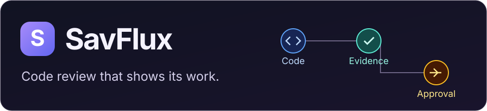
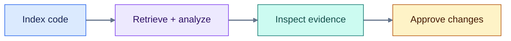

# SavFlux

**Understand a repository, review its code, and inspect the evidence before approving changes.** SavFlux combines static analysis, source-linked answers, and model-assisted review in one workspace.

**Python 3.11 · FastAPI · React 18 · Local-first** · [CI results](https://github.com/garimauttam/SavFlux/actions/workflows/ci.yml) · [MIT license](LICENSE)

**[Get started →](docs/GETTING_STARTED.md)** · [Documentation](docs/README.md) · [Workspace tour](docs/WORKSPACE.md) · [Troubleshooting](docs/TROUBLESHOOTING.md)

## What you can do

| Understand | Review | Decide what ships |
| --- | --- | --- |
| Ask questions with file-and-line citations | Read static findings and labeled AI commentary | Compare remote GitHub branches |
| Explore indexed files and dependency graphs | Inspect source-matched suggested fixes | Inspect managed Agent edits or indexed snapshots |
| Check retrieved evidence beside the answer | Keep failures and unknowns visible | Approve the exact patch before a publishing action |

## Start here

You need **Python 3.11**, **Node 22.12+**, **Ollama**, and a **Supabase project for sign-in**. The default local-model path needs no paid model API key; initial downloads and authentication still need network access.

1. Follow [Getting started](docs/GETTING_STARTED.md) to configure sign-in and launch both servers.
2. Index a repository and try a small review using the [workspace guide](docs/WORKSPACE.md).
3. Choose local models or explicitly configured hosted free tiers in [Model connections](docs/MODEL_CONNECTIONS.md).

> **Updating an existing checkout?** Run `npm ci` inside `frontend/` after pulling, then restart both frontend and backend. See [update instructions](docs/GETTING_STARTED.md#update-an-existing-checkout).

## How it fits together

```mermaid
flowchart LR
    A["Index code"] --> B["Retrieve + analyze"]
    B --> C["Inspect evidence"]
    C --> D["Approve changes"]
    classDef data fill:#dbeafe,stroke:#2563eb,color:#172554
    classDef work fill:#ede9fe,stroke:#7c3aed,color:#2e1065
    classDef evidence fill:#ccfbf1,stroke:#0f766e,color:#134e4a
    classDef gate fill:#fef3c7,stroke:#b45309,color:#451a03
    class A data
    class B work
    class C evidence
    class D gate
    linkStyle default stroke:#64748b,stroke-width:2px
```

Index the selected code, retrieve context and analyze it, inspect source-linked evidence, then explicitly approve any publishing action. [Explore the architecture →](docs/ARCHITECTURE.md)

## Documentation

| I want to… | Read |
| --- | --- |
| Install and run SavFlux | [Getting started](docs/GETTING_STARTED.md) |
| Navigate the app | [Workspace](docs/WORKSPACE.md) |
| Read reviews and generate fix previews | [Review workspace](docs/REVIEW_WORKSPACE.md) |
| Compare branches or indexed files | [Changes workspace](docs/CHANGES_WORKSPACE.md) |
| Index GitHub code and approve a PR | [GitHub workflow](docs/GITHUB_WORKFLOW.md) |
| Configure models, keys, and task routes | [Model connections](docs/MODEL_CONNECTIONS.md) · [Configuration](docs/CONFIGURATION.md) |
| Understand implementation and measurements | [Architecture](docs/ARCHITECTURE.md) · [Benchmarks](docs/BENCHMARKS.md) |
| Check privacy, costs, and approval boundaries | [Security and limits](docs/SECURITY.md) |
| Fix setup or runtime issues | [Troubleshooting](docs/TROUBLESHOOTING.md) |
| Test, contribute, or explore planned work | [Development](docs/DEVELOPMENT.md) · [Roadmap](docs/ROADMAP.md) |

## Know the boundaries

- **Evidence is not certainty.** Source matching verifies location, not the correctness of an AI suggestion. Inspect and test proposed edits.
- **Local-first is not offline-only.** Sign-in, GitHub, downloads, and optional cloud providers have network and privacy implications. Free tiers have quotas; paid providers remain opt-in.
- **Review is not publish.** New reviews do not reuse review-result caches, and generating a suggestion does not silently apply or push it.

[Security details](docs/SECURITY.md) · [Contributing](docs/DEVELOPMENT.md) · [MIT license](LICENSE)
