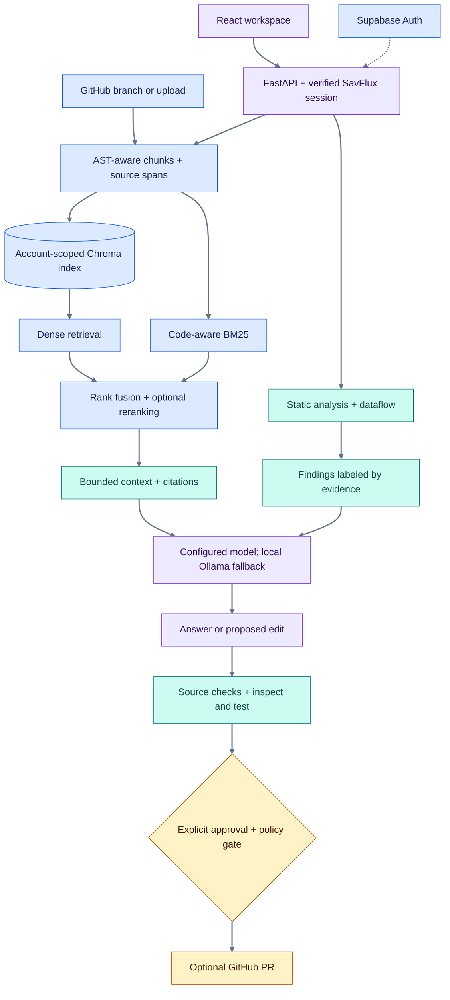

# Architecture

[Home](../README.md) / [Docs](README.md) / Architecture

SavFlux pairs deterministic analysis with retrieval-grounded model work. A React interface calls FastAPI; indexed code and evidence stay distinct from model-generated suggestions.

## System map



**Blue** describes inputs and retrieval, **teal** evidence checks, **violet** application/model work, and **amber** human approval. Labels carry the meaning too; color is not the only signal. The diagram summarizes separate workflows, not one API call that automatically publishes an edit.

## Why analyze before prompting?

A parser can trace a SQL string into an `execute()` call or identify disabled TLS without asking a model to rediscover the same pattern. SavFlux supplies that evidence to the reviewer, leaving model time for explanation and context-dependent judgment. A model's confident wording does not upgrade a heuristic into proof.

## Retrieval pipeline

1. **Intent routing + `@file` scoping** — `@auth.py where is the token checked?`
   filters the candidate pool before any search runs.
2. **Query variants** generated locally (no model call).
3. **Dense** Chroma MMR search over `max(top_k × 3, 10)` candidates, **plus** BM25
   with code-aware tokenisation (camelCase and snake_case split).
4. **Reciprocal Rank Fusion** (`k=60`, 50/50) merges the two rankings.
5. **Cross-encoder rerank** with `ms-marco-MiniLM-L-6-v2`; degrades gracefully to
   fused rank after repeated failures rather than erroring.
6. **Diversify** (max 2–3 chunks per source) and cap at the context budget.
7. **Cite** only the chunks that survived the cap.

Chunks are indexed as *windows* (~900 chars) because the embedder truncates, and the whole chunk travels in each row's metadata: the retriever searches a window, the model is handed the parent. Storing whole chunks instead is how the tail of a long function becomes invisible to search while looking present to the reader.

## Analyzer rules

**Python (AST + taint):** SQL injection · shell injection · `eval`/`exec` · unsafe deserialisation · hardcoded credentials · TLS verification disabled · weak hashes · `tempfile.mktemp` · non-constant-time secret comparison · silently swallowed exceptions · bare `except` · `assert` for validation · cyclomatic complexity · nesting depth · parameter count

**JS/TS/Go/Java/Rust (comment- and string-aware scanning):** `eval` · `new Function` · `innerHTML` · `dangerouslySetInnerHTML` · `child_process.exec` (alias-aware) · TLS disabled · weak hashes · empty catch · ignored errors · AWS/GitHub/Slack/Google key shapes · complexity

Comments and string bodies are blanked **before** matching, which removes the largest false-positive class in line scanners: `// TODO: move password to env` is not a leaked credential.

## Autofix: the three gates

A repair is kept only if **all three** hold:

1. the result parses
2. the targeted finding is gone
3. no new finding of equal or higher severity appeared

Gate 3 is the important one — a fix that trades a MEDIUM for a HIGH has made the codebase worse while looking like an improvement. Regression tests cover the verification gates, including rejection of repairs that introduce worse findings.

Fixes are minimal by construction. On a file with comments and blank lines, exactly one line changes and a trailing `# note` survives, so the reviewer reads a one-line security diff instead of a reformatted function.

## The deterministic agent and its tools

`POST /agent/run` plans from the goal, then executes local tools — no model call, so the same goal against the same index produces the same report bytes.

| Tool | What it does |
|---|---|
| `retrieve_context` | hybrid search (the retrieval half of the chat pipeline) |
| `read_file` | full file, from disk or reconstructed from the index |
| `dependency_graph` | import graph — nodes, edges, hubs |
| `blast_radius` | transitive dependents of a file |
| `autofix` | verified repairs, one file |
| `build_patch` | one git-applicable diff + digest + PR body |
| `create_pr` | PR plan; pushes only on a confirmed digest |

The goal decides how far a run may go: asking to *understand* code gets the four read-only tools, asking to *fix* adds `autofix` and `build_patch`, and only asking for a *pull request* adds `create_pr`. `GET /agent/tools` returns the catalogue with typed argument schemas and a `mutating` flag. The agent's output is a transcript of steps with their own timings, not a log line per event.

## Streaming protocol

SSE with inline markers, so the UI can render structure while tokens arrive:

| Marker | Payload |
|---|---|
| `__STATUS__…__STATUS_END__` | progress step + JSON metadata |
| `__SOURCES__…__SOURCES_END__` | citation array with spans and trust |
| `__DIAGNOSTIC__…__DIAGNOSTIC_END__` | retrieval diagnostics |
| `__SECTION_START__…__SECTION_END__` | review section boundaries |
| `__ERROR__…__ERROR_END__` | recoverable error |

Cancellation rides the same channel as a `step="cancelled"` status marker, carrying elapsed time and what was not covered — so a stopped run renders as a stopped run in every surface, with no separate error path to forget.

## Repository map

```text
backend/
  app/api/                 HTTP and streaming routes
  app/services/            Retrieval, models, ingestion, review, GitHub workflows
    code_analysis/         Static analysis and deterministic autofix
  tests/                   Backend regression tests
frontend/
  src/components/          Workspace, review, Changes and account surfaces
  src/hooks/               State and stream coordination
  src/lib/                 Shared highlighting, citations and request helpers
benchmarks/                Committed retrieval baseline
eval_rag.py                Reproducible retrieval benchmark
scripts/                   Security benchmark and documentation checks
docs/                      Task-focused documentation and diagrams
```

[Navigation](../frontend/src/navigation.ts), [backend settings](../backend/app/core/config.py), and [model routing](MODEL_CONNECTIONS.md) are useful entry points for contributors.

**Continue:** [Security boundaries](SECURITY.md) · [Benchmarks](BENCHMARKS.md) · [Development](DEVELOPMENT.md)
