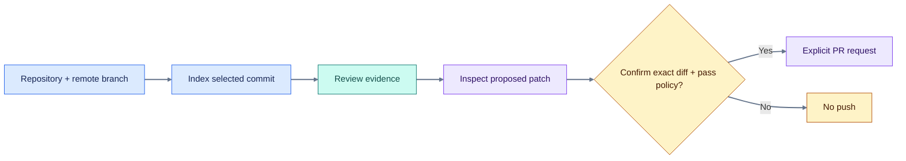

# GitHub workflow

[Home](../README.md) / [Docs](README.md) / GitHub workflow

Public indexing, branch discovery, repository metadata, and branch comparison can work without a separate GitHub connection. **SavFlux sign-in is still required.** Private repositories and write actions require appropriate GitHub access.

## From repository to approved change



## Connect only when needed

Use **Repositories → Connect GitHub** or the connection section in Profile. A token connected in the app takes precedence over `GITHUB_TOKEN` in the backend environment. Disconnecting the saved connection may expose an existing environment fallback; check the reported status.

Private clone credentials are passed through a Git HTTP header, not stored in the remote URL or `.git/config`. Grant only the access needed. A GitHub repository credential is not automatically reused for hosted model inference.

## Select and index a branch

Paste a public URL and choose **Remote branch**, or browse a connected account's repositories. The repository header stores the selected branch per repository; choose it before indexing. Branch listing is read-only, supports pagination, and offers retry on lookup errors. Selecting a ref never checks it out or pushes it.

Ingestion streams progress and supplies a job ID. If the browser loses the stream, the client can query the ingest status rather than assume completion. Model-download or indexing errors are reported instead of silently substituting fake embeddings.

## Compare branches

Open **Changes → Branches**, choose distinct base and compare refs, then press **Compare**. SavFlux reads GitHub's `base...head` result: ahead/behind counts, commit summaries, changed files, and bounded patches. Public comparisons do not need a GitHub connection, but anonymous rate limits apply. Private access failures need a connection with read permission.

Branch comparison does not use a language model and does not modify either ref. The [Changes guide](CHANGES_WORKSPACE.md) explains why Indexed files is a different operation.

## Understand the Agent workspace

After the Agent successfully builds a patch for indexed GitHub code, SavFlux can retain an isolated server-side worktree on a `savflux/agent-*` branch based on the indexed commit. This is **not your laptop checkout**. It refuses later proposals when the index/base no longer matches. **Reset edits** discards only that managed workspace's edits; it does not reset a remote branch.

## Publish with explicit approval

`POST /api/v1/review/create-pr` requires confirmation bound to the exact diff digest. A stale or swapped patch fails the check. The risk gate can additionally require an approval token and reason, or block a change. A patch proved not to apply is not pushed. Without a usable GitHub token, the workflow can return a patch and a `gh pr create` command instead of writing remotely.

## API reference

| Method | Path under `/api/v1` | Purpose |
| --- | --- | --- |
| GET | `/github/status` | Connection validity and credential source |
| POST / DELETE | `/github/connect` | Save or remove a connection |
| GET | `/github/repos?q=&page=` | Browse connected-account repositories |
| GET | `/github/repos/{owner}/{name}` | Repository metadata |
| GET | `/github/repos/{owner}/{name}/branches?page=1` | Remote refs |
| POST | `/github/compare` | Read-only branch comparison |
| GET | `/github/repos/{owner}/{name}/pulls` | Pull requests |
| GET | `/github/pulls/{owner}/{name}/{number}` | Pull-request details |
| GET | `/workspace/status?repo=owner/name` | Managed Agent worktree diff |
| POST | `/workspace/reset?repo=owner/name` | Explicitly discard managed workspace edits |

```bash
curl -sS "$SAVFLUX_URL/api/v1/github/compare" \
  -H "Authorization: Bearer $SUPABASE_ACCESS_TOKEN" \
  -H "Content-Type: application/json" \
  -d '{"repo":"owner/repository","base":"main","head":"feature/my-change"}'
```

Use a current SavFlux access token in your own environment; do not paste credentials into issues or screenshots.

**Continue:** [Changes guide](CHANGES_WORKSPACE.md) · [Security and approval](SECURITY.md)
